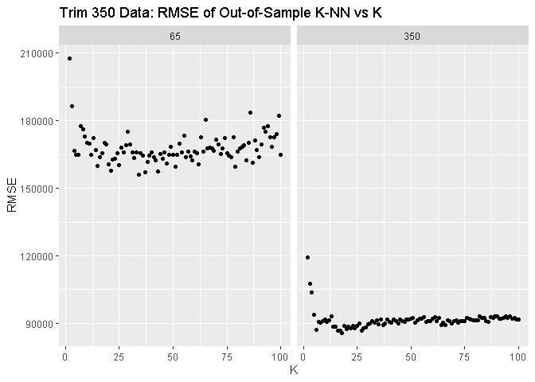

1 Data Visualization: Gas Prices
================================

In this exercise, we will be examining data from 101 gas stations in the
Austin area from 2016. Some simple plots will be assembled to determine
general trends about the data with human observations.

A) Theory: Gas stations charge more if they lack direct competition in sight (boxplot).
---------------------------------------------------------------------------------------

    ggplot(data = data1) + 
      geom_boxplot(mapping=aes(x=Competitors,y=Price)) + 
      labs(title = 'Boxplot of Prices for Gas Stations based on Competitors (Y/N)',y='Price (USD)')

From this boxplot, it can be seen that the median and upper quartile of
the price are both higher in the gas stations without competitors. Only
drawing conclusions based on this plot alone, it would not be
unreasonable to state that it appears that gas station without
competitors nearby charge higher prices.

B) Theory: Gas stations charge more if they lack direct competition in sight (boxplot).
---------------------------------------------------------------------------------------

    ggplot(data = data1) + 
      geom_point(mapping=aes(x=Income,y=Price)) + 
      labs(title = 'Median Income of the ZIP Code against Price',x='Price (USD)')

From this scatter plot, there does seem to be positive, albeit weak,
relation between the income and price when examining just by eye.

C) Theory: Shell charges more than other brands (bar plot).
-----------------------------------------------------------

    ggplot(data = data1) +
      geom_bar(mapping = aes(x=Brand,y=Price),stat='summary') +
      labs(title='Average Price of Each Competitor',y='Price (USD)')

The average price of each competitors appears to be roughly the same
between all the different brands by examination of the plot; so, we
conclude (quite skeptically) that Shell does not charge more than the
other brands.

D) Theory: Gas stations at stoplights charge more (faceted histogram).
----------------------------------------------------------------------

    ggplot(data = data1) + 
      geom_histogram(mapping=aes(x=Price,y=stat(count)/sum(stat(count))),binwidth = 0.05) +
      facet_wrap(~Stoplight) + 
      labs(title = 'Histogram of Price for Gas Stations Near Stoplights (Y/N)',x='Price (USD)',y='Density')

From examination of the two histogram plots, it can be seen that there
is a larger density of gas stations with a higher price near a
stoplight.

E) Theory: Gas stations with direct highway access charge more.
---------------------------------------------------------------

    ggplot(data = data1) +
      geom_boxplot(mapping=aes(x=Highway,y=Price)) +
      labs(title = 'Boxplots of Price for Gas Stations Near Highway Exits (Y/N)',x='Price (USD)')

After examining both boxplots, the conclusion can be drawn that the gas
stations near highway exits have higher prices.

2 Data Visualization: a bike share network
==========================================

Similar to the last exercise, we will again employ data visualization to
draw conclusions about the trends of a data set. The data set of concern
for this exercise is from a bike-sharing rental system; it has been
aggregated on daily and hourly basis then combined with weather
information.

Plot A:
-------

    data2_avg <- data2 %>% 
                  group_by(hr) %>%
                  summarize(avg = mean(total))
    ggplot(data = data2_avg) + 
      geom_line(mapping=aes(x=hr,y=avg)) + 
      labs(title = 'Avg Bike Rentals Over Hour of the Day',x='Hour of the Day',y='Avg Number of Bike Rentals')

From examination of this plot, it can be seen that ridership spikes at
around hour 8 and hour 17.

Plot B:
-------

    data2_avg_wkday <- data2 %>%
                        group_by(hr,workingday) %>%
                        summarize(avg = mean(total))
    ggplot(data = data2_avg_wkday) + 
      geom_line(mapping=aes(x=hr,y=avg)) + 
      labs(title = 'Avg Bike Rentals Over Hour of the Day',x='Hour of the Day',y='Avg Number of Sales') +
      facet_wrap(~workingday,labeller=labeller(workingday=c('0'='Not Working Day','1'='Working Day')))

With this plot, allowing comparison of working and non-working day bike
rental over the day, we can see that bike rentals over not working days
is more smooth as it rises in the morning, peaks in the afternoon then
declines back down in the evening. However, in contrast, during working
days there are two distinct spikes which seem to be in the morning and
even which align with typical working hours.

Plot C:
-------

    data2_avg_wkday_8am <- data2 %>%
                            filter(hr==8) %>%
                            group_by(weathersit,workingday) %>%
                            summarize(avg = mean(total))
    ggplot(data = data2_avg_wkday_8am) +
      geom_bar(mapping=aes(x=weathersit,y=avg),stat='identity') +
      facet_wrap(~workingday,labeller=labeller(workingday=c('0'='Not Working Day','1'='Working Day'))) +
      labs(title='Avg Bike Rentals at 8 AM',y='Avg Number of Sales',x = 'Weather Situation Code')

This plot shows that the average rentals at 8 AM are higher on
non-working days and theres a somewhat downward trend as weather
situation codes increases which signifies increasingly worse weather.

3 Data Visualiszation: Flights at ABIA
======================================

Like before, in this exercise data visualization will be the at the
forefront; we use a heat map to determine generally when may be good to
fly to avoid delays using data on every commercial flight in 2008 that
went through Austin-Bergstrom Internation Airport.

    #convert to minutes(hhmm to # of minutes)
    convert <- function(x){
      return(trunc(x/100)*60+x-trunc(x/100)*100)
    }

    #data processing
    data3_post <- data3 %>% 
                    mutate(delay = convert(DepTime)-convert(CRSDepTime),DepTime_hr = convert(DepTime)/60) %>% 
                    filter(delay > 0) %>%
                    group_by(DayofMonth,Month) %>%
                    summarise(DepTime_hr=DepTime_hr,mean_delay=mean(delay))

    #plot
    ggplot(data=data3_post) +
      geom_tile(mapping=aes(y=Month,x=DayofMonth,fill=log(mean_delay))) +
      scale_fill_distiller(palette = "YlOrRd") + 
      labs(title='Avg Delay for Each Day in the Year',x='Day of the Month',y='Month')

From this plot, we can see that for the most part delays are fairly
uniform. However, there seems to be less delays towards the end of the
year and beginning of the month.

4 K-Nearest Neighbors
=====================

The data set of interest is information on over 29,000 Mercedes S Class
vehicles (which have a great deal of subclassses). Specifically, we are
interested in modeling the predictive capabilities to predict the sales
price using K-nearest neighbors given mileage. We will focus on the trim
level sub-model categories 350 and 65 AMG, subsetting the data for each,
in order to eliminate specifics of each model that may affect price if
we were to aggregate them.

Part 1: Split the data into training and testing set
----------------------------------------------------

We begin by building two subsets of our original data; one for trim
level 350 and one for 65 AMG. Then each of these subsets are split into
a training set (in-sample) and testing set (out-sample). As the names
suggest, the training set will be use to train the predictive model,
while the testing set will be used to test predictive capabilities. The
training set will be roughly 80% of the initial subset and the remaining
~20% will be the testing set.

    #split the data into the different trims
    data4_trim350 <- data4 %>% filter(trim==350)
    data4_trim65 <- data4 %>% filter(trim=='65 AMG')

    #split each into training (80%) and testing (20%) sets
    set.seed(101)
    train_pct <- 0.8

    sample_trim350 <- sample.int(n = nrow(data4_trim350), size = floor(train_pct*nrow(data4_trim350)), replace = F)
    data4_trim350_train <- data4_trim350[sample_trim350, ]
    data4_trim350_test  <- data4_trim350[-sample_trim350, ]

    sample_trim65 <- sample.int(n = nrow(data4_trim65), size = floor(train_pct*nrow(data4_trim65)), replace = F)
    data4_trim65_train <- data4_trim65[sample_trim65, ]
    data4_trim65_test  <- data4_trim65[-sample_trim65, ]

Part 2: Run K-nearest neighbors
-------------------------------

Here the K-nearest neighbor (K-nn) algorithm is written for use. The way
it is written here will take a new (testing) set to output the
predictions using the training set. However, while it is written to take
in a vector of new points and returns a vector of predictions, the
function itself is not written with vector operations. Rather, it takes
each point individually to perform the prediction.

    #k-nn function
    knn <- function(data,k,x_new,x,y){
      x <- deparse(substitute(x))
      y <- deparse(substitute(y))
      
      y_new <- rep(0,length(x_new))
      for(n in 1:length(x_new)){
        points <- data[sample(nrow(data),k),]
        x_points <- points[,x]
        y_points <- points[,y]
        for(i in 1:length(data[,1])){
          if(abs(data[i,x]-x_new[n]) < max(abs(x_points-x_new[n]))){
            index <- which(abs(x_points-x_new[n])==max(abs(x_points-x_new[n])))
            x_points[index] <- data[i,x]
            y_points[index] <- data[i,y]
          }
        }
        y_new[n] <- mean(y_points)
      }
      return(y_new)
    }

Part 3:
-------

Now we run the K-nn function while varying the K parameter from 2 to
100. While going out to 100 is likely unnecessary, we do so to be able
to comfortable in our determination of the K which yields the lowest
RMSE. As can be seen from the plots below, both RMSE trends down into a
dip then gradually increases again.

    #out-of-sample rmse
    rmse <- function(pred,true){
      return(sqrt(sum((true-pred)^2)))
    }

    k_values <- 2:100
    rmse_kdata_trim350 <- rep(0,length(k_values))
    rmse_kdata_trim65 <- rep(0,length(k_values))

    for(i in 1:length(k_values)){
      rmse_kdata_trim350[i] <- rmse(data4_trim350_test[,'price'],knn(data4_trim350_train,i,data4_trim350_test[,'mileage'],mileage,price))
    }
    for(i in 1:length(k_values)){
      rmse_kdata_trim65[i] <- rmse(data4_trim65_test[,'price'],knn(data4_trim65_train,i,data4_trim65_test[,'mileage'],mileage,price))
    }

Out-of-Sample RMSE Plots
------------------------

    ggplot(data = data.frame(k_values,rmse_kdata=c(rmse_kdata_trim350,rmse_kdata_trim65),trim350or65AMG=c(rep(350,length(rmse_kdata_trim350)),rep(65,length(rmse_kdata_trim65))))) +
      geom_point(mapping=aes(x=k_values,y=rmse_kdata)) +
      facet_wrap(~trim350or65AMG,nrow=1) +
      labs(title='Trim 350 Data: RMSE of Out-of-Sample K-NN vs K',x='K',y='RMSE')

"Optimal" K Plots
-----------------

The "dip" is where we will determine our "optimal" K for K-nn to be.
However, due to the random procedure in procuring the training and
testing set this K determination will likely have some variation (which
can be address with cross validation). In this case, we simply define
"optimal" as the K that produces the lowest RMSE in out-of-sample
performance.

    #id lowest K value that produces lowest RMSE
    lowest_rmse_trim350 <- k_values[which(rmse_kdata_trim350==min(rmse_kdata_trim350))]
    lowest_rmse_trim65 <- k_values[which(rmse_kdata_trim65==min(rmse_kdata_trim65))]

    #pred vs x plots
    f_lowest_trim350 <- function(x) return(knn(data4_trim350_train,lowest_rmse_trim350,x,mileage,price))
    f_lowest_trim65 <- function(x) return(knn(data4_trim65_train,lowest_rmse_trim65,x,mileage,price))

    ggplot(data=data4_trim350_test) +
      geom_point(mapping=aes(x=mileage,y=price)) +
      geom_function(fun=f_lowest_trim350,col='red') + 
      labs(title=paste('Trim 350 Out-of-Sample Performance with K =',lowest_rmse_trim350))

    ggplot(data=data4_trim65_test) +
      geom_point(mapping=aes(x=mileage,y=price)) +
      geom_function(fun=f_lowest_trim65,col='red') + 
      labs(title=paste('Trim 65 AMG Out-of-Sample Performance with K =',lowest_rmse_trim65))

The 65 AMG trim data yields a larger optimal value of K that minimizes
RMSE. This is likely due to larger variance in the data and lower amount
of observations for this data subset; a higher K is needed to lower the
variance in the data (higher bias).
