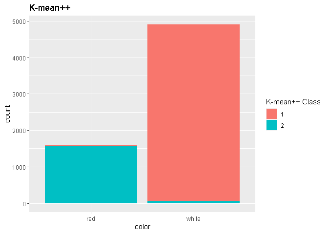
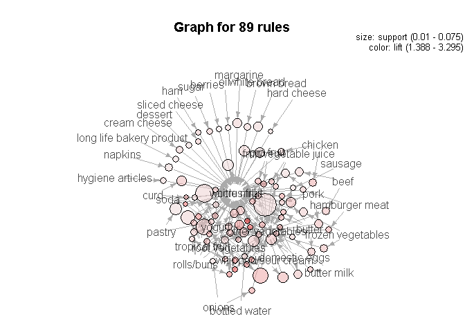

1 Clustering and PCA
====================

In this part of the exercise, we will explore how classification methods
from machine learning connects to human classification. The data set of
interest is one about different wines; what particular chemicals they
contain, their color and how they are scored by a human. This leads to
two very natural categories which humans use: the color and the scoring.
The color is determined by the wine's chemical composition and less open
to interpretation while the scoring is very much open to interpretation.

The first method of classification is principle component analysis. The
data set has 11 dimensions (after removing the human classfication
columns) and the reduction was done to 2 and 7. 2 was chosen as it would
allow for easy visualization to see if the human classifications had
indeed appeared, but also explains about 50% of the variation. 7 was
chosen as it would be the same number ranks in the scoring system. In
reality the scoring system spans from 1-10. However, the actual scores
of the wine empirically spans from 3-9.

The following plot shows that there is indeed a natural classification
of the wine in terms of color with the 2 dimensional PCA. There appears
to be more mixing along PC2 but PC1 has a very definitive split between
the two.

In the same vein of clustering into to obtain two categories, K-means
can also be used to see if color emerges as the natural classification
when the number of groups is set to two. From the plot below, it can be
seen that the K-means++ classification method has indeed found its way
to the wine color (with a few errors).

Then to analyze the PCA of rank 7 to see if the scoring classification
emerges, K-means++ is used to determine the exact grouping. This is
because visualization in seven dimensions is very difficult. The plots
show that the clustering algorithms employed do not find the scoring by
humans; the histograms show a distribution of all the different groups
among each of the scores.

Thus, we find that wine color naturally emerges as a classification when
clustering on the chemical composition of the wine, but the human
scoring does not.

2 Market segmentation
=====================

Here we want to examine the follower base of "NutrientH20" on Twitter to
understand their social media audience. As a preliminary analysis of
their audience, the mean of each category can be examined.

Then the data needs to be processed. Given that "chatter" and
"uncategorized" do not provide much insight into the nature of the
audience, these can be cut.

The plot below shows that the on average their followers have tweets
most frequently regarding cooking, photo sharing, health nutrition and
"chatter". On a human level, this is a fairly reasonable outcome as
health nutrition is directly related to the NutrientH20's products of
consumer drinks. Furthermore, photo sharing is a popular activity among
those in the health product industry. Cooking is tangentially related to
health product industry as "healthy cooking" is a key component of that
lifestyle.

To better understand the different groups within the social media
audience "NutrientH20", we can use K-mean clustering. Since this is
supervised machine learning, the number of groups necessary are not well
defined; a balance must be struck between some metric of optimality in K
groups and intrpetability by humans. The metric that will be used is a
within-cluster sum of squares at each K.

From this plot, it can be seen that the "elbow" (or level off point in
diminishing return) occurs somewhere around K=15. However, examination
the difference in 15 seperate groups may prove too be too challenging if
a human level understanding needs to be reach. So, K=4 can be chosen as
the "elbow" plot shows that within-cluster sum of squares does seem to
decrease monotonically which leads to the conclusion that the highest K
with human understanding should be chosen.

From the heatmaps plotted of the scores of each category for each
invidiual in a group, the nature of these groups can be discerned. Group
1 has "light" bands across in "health nutrition" and "cooking" so this
represents the section of the company's audience that are specifically
interested in exactly the marketing around their product. Group 2 has
many more light bands such as "sports fandom", "religion", "parenting"
and "food" which likely is their more average type of consumer that uses
their product and follows them but are not necessarily very invested in
the health lifestyle industry. Group 3 seems to be fairly uniform
meaning that it is likely just inividuals who did not fit in the other
groups. Group 4 has light bands on "politics" and "news" which are
followers who are likely going to be invested in the political stance
and ideology of the company as well as its social impact.

The histogram of group distribution shows that group 3 is the most
popular, which is to be expected as it is the "other" kind of group.
Following that is Group 1 which are the ones who care likely care about
the healthy lifestyle; this is a group that the company would probably
like to grow as much as possible so targeted marketing campaigns could
use this group as a metric for performance. Group 4 is the political
group which shows that they represent a non-negligible portion of their
following; this means that the marketing team should be concious of
political statements or, even, work popular political stances into their
advertisements.

3 Association rules for grocery purchases
=========================================

For this portion of the exercise, we want to mine for association rules
in a data set regarding grocery shopping habits. The data comes in a
format requires some processing before being able to run the apriori
algorithm. The processing required takes the dataset and coverts it into
a list where each entry of the list is the items bought by each
individual.

After processing, the result can be fed into the apriori algorithm to
obtain the association rules. At a cursory inspection of a few of the
rules, it can be seen that many rules show that "root vegetables" is
associated with many other products.

However, a more subset of the rules would easier to understand at a
human level. Plots of the confidence, lift and support of each rule give
visual cues as to what levels for each to trim by.

From the plot, a majority of the points with fairly high lift seem to
have confidence above 0.35 and support above 0.01; now the rules can be
subsetted from this condition. The visualization below is a bit hard to
read with the number of rules and crowding of the text, but an overall
trend towards "whole milk" can be made out which makes sense at it is a
very popular item. Then there is some interconnections between the
different kinds of vegetables and fruits on the right side. The left
side shows that cheeses and bakery items are fairly seperated but both
lead into "whole milk".

 \# 4
Author attribution We have a database of text from 50 different authors
and we would like to build an predictive pipline to be able to determine
the authorship of a particular text. The data comes pre-split between a
training and testing set. Since each author has a separate text file,
they will each be imported to an element of a list for ease of use.
After importing the data, it is passed into a corpus where it is removed
of white space, punctuation and and numbers. However, at this stage,
certain words that carry no information regarding who the author is will
also be striped, such as articles.

Once the data is in a corpus it can be transformed into a document term
matrix which is a sparse matrix that can be fed into traditional machine
learning algorithms. The testing matrix will also be limited to only
words that appear in the training set as not to confuse the algorithms
with unseen words.

As a classification problem, the implementation of logit regression
would be appropriate along with lasso with the high dimensionality of
the dataset. Given that there are 50 authors and that there is no reason
to expect predictive performance to be uniform across them, the model
can evaluated across all of them to ascertain performance.

To gain an insight into the predictive performance of the model, the
plots below show the accuracy (obtained via a confusion matrix) of the
model out-of-sample. These plots show that there is a fairly high
accuracy with a mean of about ~90% across all the different authors.

